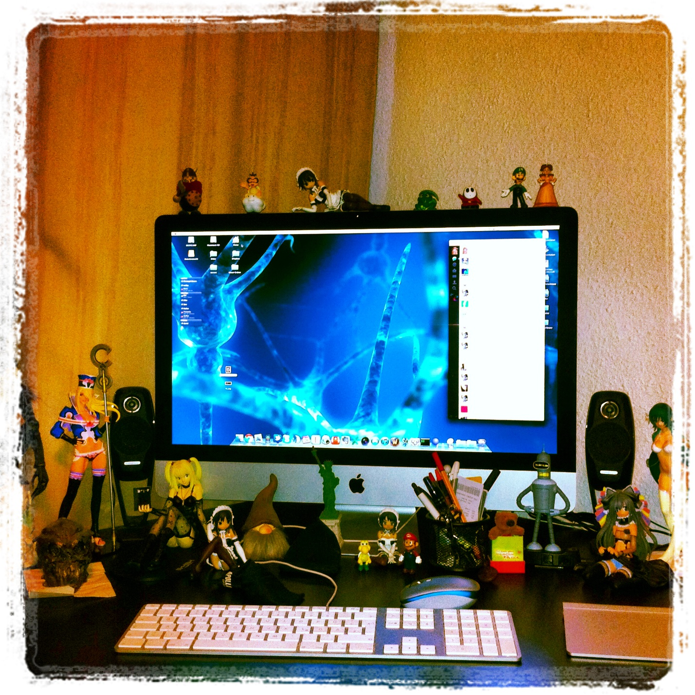

# le me

 Ich bin Pessimist aus Leidenschaft, Sarkasmus ist meine Sprache, Ironie sind meine Worte. Aber da mir eh nur Wenige zuhören, verhallt das Meiste im Nichts. Ich bin nur die leise Stimme aus dem Off, welche ruhig anmerkt: „Hab ich es nicht gleich gesagt? Warum hört denn nie einer auf mich?“. Aber nicht alles was ich sage ergibt gleich oder überhaupt einen Sinn. Schiefe Kommentare zu passende oder auch sehr unpassenden Zeiten sind genauso an der Tagesordnung wie das Erdenken unmöglicher Situationen und Reaktion auf diese. Wie oft stand man schon plötzlich durch den einen oder anderen Satz im Mittelpunkt, oder war auf Grund eines ausgelassenen Gespräches Hauptthema der Nebenstehenden.

# le work

Fachinformatiker für Systemintegration, also Administrator. Ausgebildet von einen hier nicht näher genannten, magenta-farbenen Konzern. Spezialisiert in Richtung Linux. Consultant bei einem nicht näher genannten gelben Konzern. Aufgabengebiet war früher alles vom Drucker bis zum Server. Heute allerdings nur noch Server und da auch nur die, die mit Linux laufen. Managen von komplex verteilten Serverlandschaften und den Belangen von Usern, die ihr Password verlegt haben. Von „das Internet ist Langsam“ bis wir brauchen da mal kurz eine neue Testumgebung. Lerne nebenbei auch noch ein wenig Beratersprech: „Da bin ich ganz bei euch“, „da braucht ihr mich nicht abholen“ „darauf können wir uns Committen!“. „Wir müssen das Produkt beim Kunden im Kopf formen!“ „Vorher sehe ich sonst keinen Benefit für uns.“

# me gusta

SciFi, GitarreSchlagzeugBass, gut gemachten Pop und Rap, Streetpunk, Die Ärzte, Marvel, Mangas, Anime, Ungewöhnliches und Neues, Fantasy-Art, eigentlich alles Mögliche an Fantasy/SciFi und alles aus Japan ^_^,Zeitreisen (!), iPhone/Pad/Pod – kurz alles von Apple, Chatten, soup.io, tumblr, 4chan, rage comics, technische Spielereien, Dinge ordnen …

# @unimatrix01

